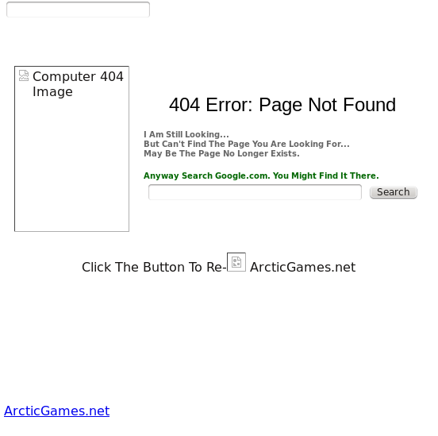

Movie Info
==========

Search for movie details using themoviedb.org API and Google Play data.

This application requires Ruby 1.9.3.

You can run the application by running next commands from script's directory:

    user@comp:~> git clone git@github.com:andrew-github/movie_info.git
    user@comp:~> cd movie_info
    user@comp:~/movie_info> bundle install
    user@comp:~/movie_info> rails s

## Few notes
### Using anonymizer
In Ukraine we have no possibility to use https://play.google.com/store/movies :

So I implemented functionality using Google Play through anonymizer.
I've made just a link to movie's Google Play page where user will see buy and/or rent buttons. Because when I've tried
to click on 'buy' button on movie's Google Play page it shows me this for each try:

### themoviedb.org API key
My key placed in this file:

    /config/initializers/ruby-tmdb.rb

You can change it to yours if you want.

### Google Play url
As I've used Google Play through anonymizer. It's url looks ugly:

  /app/models/google_play_scraper.rb

    GOOGLE_PLAY_URL = 'http://proxy.arcticgames.net/proxy/index.php?____pgfa=aHR0cHM6Ly9wbGF5Lmdvb2dsZS5jb20vc3RvcmUvc2VhcmNo&q=placeholder&c=movies'

I suppose it should looks like this for USA:

    https://play.google.com/store/movies&q=placeholder&c=movies
